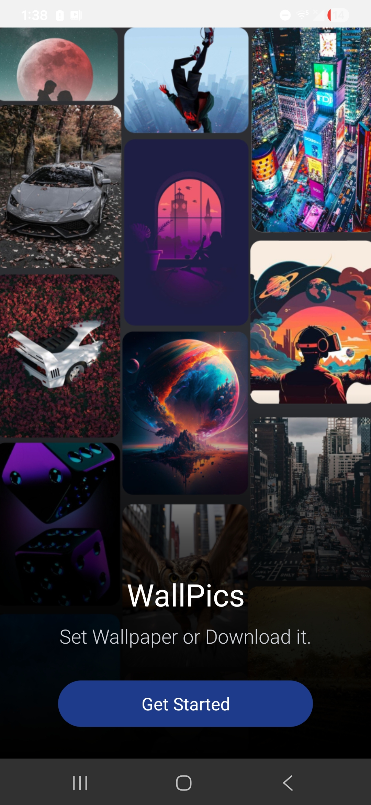
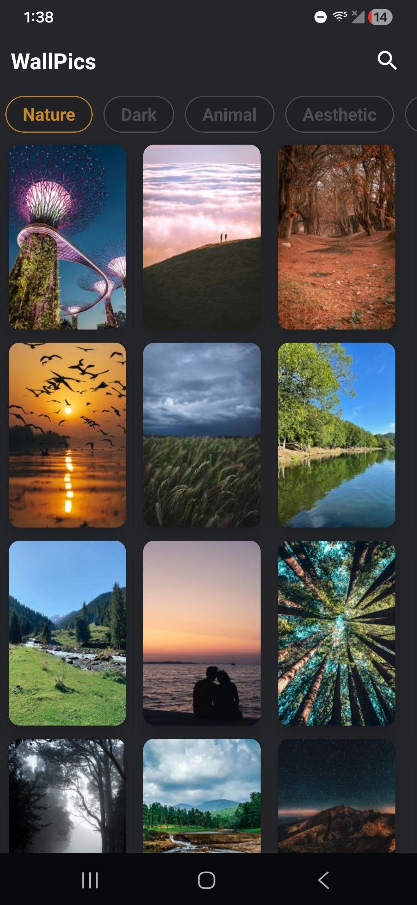
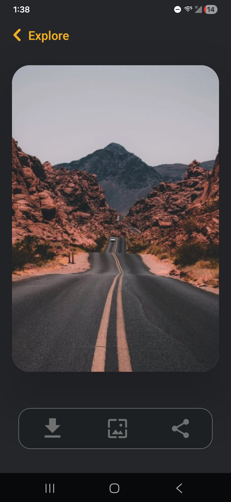

# Wallpaper App

This app allows users to browse wallpapers, search images, download them, share with other apps, and set wallpapers directly on Android devices.

I built this project to practice real-world mobile app development using React Native and to work with image handling, device storage, and Android native features.

## What this app does

- Shows a list of wallpapers  
- Search wallpapers by keyword
- Set image as device wallpaper  
- Download images to device storage  
- Share wallpapers with other apps  

## Tech Used

- React Native  
- JavaScript  
- Sanity (for managing wallpaper data)

## Download APK

[Download APK](https://github.com/vaishnav-mandlik/WallPaper-App/releases/download/v1.0/WallPics.apk)

## Demo Video

[YouTube](https://youtube.com/shorts/17eeESWaa9g)

  

## Screenshots

  
  
  

